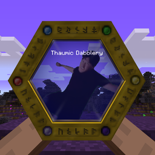

# Thaumic Dabblery

## Features

* Extends ModTweaker Thaumcraft 4 compatibility
    * Vis discount modification for equippables (armor and baubles)
    * Equipped item warp and runic shielding modification
    * Entity and item scanning based prerequisites for research
    * Safe research movement and removal
    * Reload-safe Thaumonomicon tab name, icon, and background overrides
    * Thaumic Horizons player vat infusion recipe modification
* Thaumic Horizons self-infusion allowing the player to cast Witchery Mystic Branch spells using a keybind, with a creative grant item.

Documentation can be found [here](https://github.com/JackOfNoneTrades/ThaumicDabblery/wiki/Documentation)

<!--

-->

## Dependencies

* [Thaumcraft 4](https://www.curseforge.com/minecraft/mc-mods/thaumcraft) 
* [Modtweaker](https://www.curseforge.com/minecraft/mc-mods/modtweaker)   
* [UniMixins](https://modrinth.com/mod/unimixins)   

## Building

`./gradlew build`.

## Credits

* [GT:NH buildscript](https://github.com/GTNewHorizons/ExampleMod1.7.10)
* [AlexSocol's StatTweaker](https://bitbucket.org/AlexSocol/stattweaker), whose Thaumcraft integration inspired the item warp and runic shielding scripting support

## License

`CC BY 4.0`.

 

