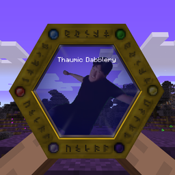

# Thaumic Dabblery



## Features

* Extends ModTweaker Thaumcraft 4 compatibility
    * Custom primal and compound aspects with scripted names, icons, colors, components, and descriptions
    * Gadomancy Aura Pylon potion effects for custom or existing aspects, with multiple entity targets and reload-safe replacement of native effects
    * Vis discount modification for equippables (armor and baubles)
    * Per-aspect wand cap and fixed casting item Vis discount customization, including Thaumic Bases bracelets
    * Wand cap/core assembly cost customization
    * Wand core capacity, Vis regeneration, and innate Potency customization, including individual Thaumic Bases and Thaumic Concilium bracelets
    * Equipped item warp and runic shielding modification
    * Entity and item scanning based prerequisites for research
    * Safe research movement and removal
    * Reload-safe Thaumonomicon tab name, icon, and background overrides
    * Reload-safe Thaumonomicon tab ordering, including compatibility with TC4Tweaks
    * Focal Manipulator upgrade path customization
    * Thaumic Horizons player vat infusion recipe modification
* Configurable minimum Vis cost for casting and crafting, including Thaumic Bases bracelets
* Configurable champion mob whitelist/blacklist, base spawn chance and guaranteed champions
* Scriptable Baubles Expanded slot assignments for ordinary items and existing baubles, including multiple allowed slot types and GTNH/original Witching Gadgets compatibility
* Salis Arcana compatibility preventing wand cap/core replacement from changing Thaumic Bases and Thaumic Concilium bracelet variants
* Thaumic Horizons self-infusion allowing the player to cast Witchery Mystic Branch spells using a keybind, with a creative grant item.

Documentation can be found [here](https://github.com/JackOfNoneTrades/ThaumicDabblery/wiki/Documentation).

### Gadomancy Aura Pylon scripting

With Gadomancy installed, put rules in ordinary `scripts/*.zs` files:

```zenscript
import mods.gadomancy.AuraPylon;

AuraPylon.clear("aqua"); // Remove all native and earlier scripted behavior.
AuraPylon.add("aqua", "players", 13); // Water breathing.
AuraPylon.add("aqua", "players", 16); // Night vision, alongside water breathing.
AuraPylon.add("aqua", "entity:Squid", 13);
AuraPylon.removeCustom("aqua", "players", 16);
```

Targets are `players`, `living`, `undead`, or `entity:<registered ID>` (case sensitive).
Aspect tags include custom aspects registered at startup. `add` preserves existing native
behavior unless cleared first; `remove(aspect)` is an alias for `clear(aspect)`.
`removeCustom` removes all scripted rules matching the aspect, target, and potion ID.
Reloading after removing scripts restores the original effects.

The extended overload is `add(aspect, target, potionId, amplifier, addedTicks, maxTicks,
intervalTicks, range)`. Defaults are `0, 10, 1200, 4, 8`: level I, adding 10 duration
ticks every 4 ticks up to 60 seconds, using Gadomancy's box range of 8 blocks.
Amplifiers must be 0–127; range must be greater than 0 and at most 64. Instant potions
are unsupported. Native potion immunity and same-potion merging still apply. Exact
duplicate rules apply once; different overlapping rules can both add duration.

Clearing stops future behavior, including native block effects; existing potions expire
normally and past world changes remain. Native Lux spawn suppression can linger for
up to 16 ticks. Gadomancy's aspect blacklist still applies. Disable the feature through
`features.auraPylon.enabled` to restore native behavior. For new or changed research
descriptions, supply `gadomancy.aura.effect.<aspect tag>` in a language resource pack.

[](https://github.com/JackOfNoneTrades/ThaumicDabblery/releases)
[](https://modrinth.com/mod/thaumic-dabblery/settings/versions)
[](https://www.curseforge.com/minecraft/mc-mods/thaumic-dabblery)
[](https://67.fentanylsolutions.org/mod/thaumic-dabblery)
[](https://maven.fentanylsolutions.org/#/releases/org/fentanylsolutions/thaumicdabblery/ThaumicDabblery)


## Dependencies

* [Thaumcraft 4](https://www.curseforge.com/minecraft/mc-mods/thaumcraft) [](https://www.curseforge.com/minecraft/mc-mods/thaumcraft)
* [Modtweaker](https://www.curseforge.com/minecraft/mc-mods/modtweaker) [](https://www.curseforge.com/minecraft/mc-mods/modtweaker) [](https://modrinth.com/mod/modtweaker/versions) 
* [UniMixins](https://modrinth.com/mod/unimixins) [](https://www.curseforge.com/minecraft/mc-mods/unimixins) [](https://modrinth.com/mod/unimixins/versions) [](https://github.com/LegacyModdingMC/UniMixins/releases)

## Building

`./gradlew build`.

## Credits

* [GT:NH buildscript](https://github.com/GTNewHorizons/ExampleMod1.7.10)
* [AlexSocol's StatTweaker](https://bitbucket.org/AlexSocol/stattweaker), whose Thaumcraft integration inspired the item warp and runic shielding scripting support

## License

`CC BY 4.0`.

<br>


### Primal aspects and component edits

Startup scripts in `config/thaumicdabblery/aspects/` can use
`mods.thaumcraft.CustomAspects.registerPrimal(tag, color, image, description, hiddenUntilScanned)` and
`CustomAspects.setComponents(aspect, first, second)`. Optional scan-gated primals remain unknown until a successful
item scan; discovery persists and synchronizes. Component edits preserve the aspect object and affect combination,
scanning and decomposition. Cycles and ambiguous final pairs are rejected before applying the batch.

Both operations require a client/server restart. Native wand recipe costs retain their original primals; explicit
extra vis costs are shown on additional arcane-workbench pages. See the
[custom-aspects guide](https://github.com/JackOfNoneTrades/ThaumicDabblery/wiki/Custom-Aspects) for examples and limits.
